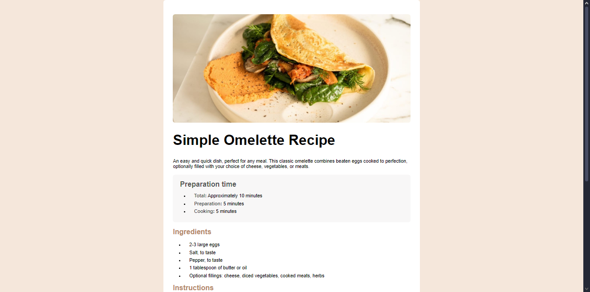
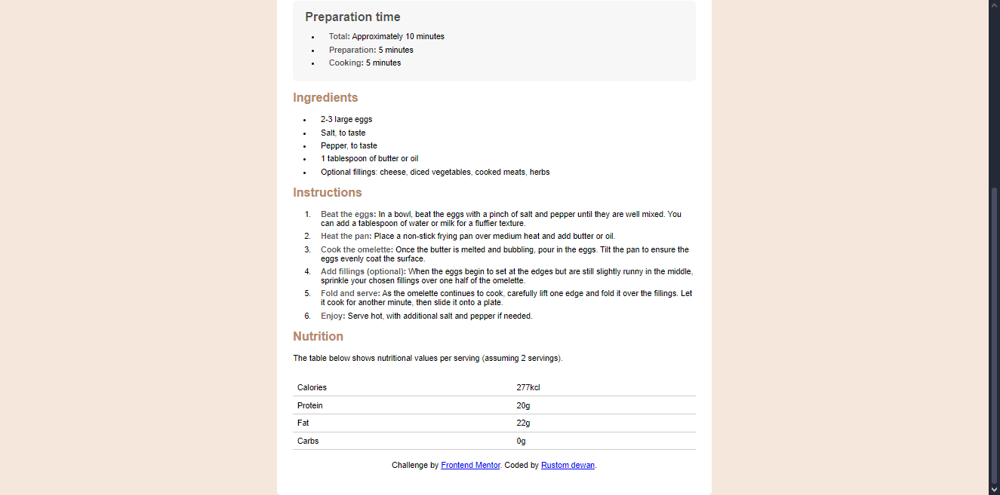

# projects

this is my first project that am doing using the layout from frontend mentor webisite and if there is something thats am missing or somethings thats i overdid it i would like to a review from you guys so i can learn more 

Frontend Mentor - Recipe page solution

This is a solution to the [Recipe page challenge on Frontend Mentor](https://www.frontendmentor.io/challenges/recipe-page-KiTsR8QQKm). Frontend Mentor challenges help you improve your coding skills by building realistic projects. 

## Table of contents

  - [Screenshot](#screenshot)
  - [My process](#my-process)
  - [Built with](#built-with)
  - [What I learned](#what-i-learned)
  - [Continued development](#continued-development)

### Screenshot

## My process
first create the background and set the background and create the container to do eveything on it.

### Built with

- Semantic HTML5 markup
- Css custom properties
- CSS Grid

### What I learned

i learned a lot about html and css and it easys now caus i remember most of the element and syntax caus of those error and will help me alot in the future. and as for a responsive am still weak for that area.

### Continued development

I would like to continue develop in frontend area so i can do most of the thing without getting stuck and for a responsisve i would like to refine it more and more caus its hard to work with it.

## Author

- Website - [Rustom Dewan]
- Frontend Mentor - [@Rustom0](https://www.frontendmentor.io/profile/Rustom0)

## Acknowledgments
i would like to thanks blackbox for giving me a layout for the design and helping me with the responsive problem.
